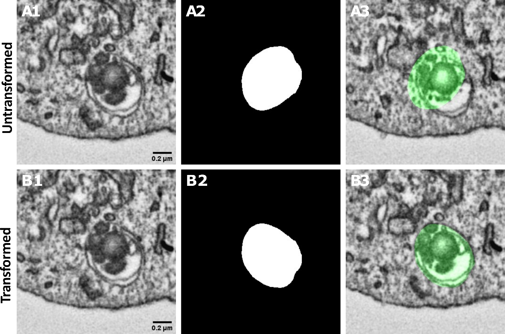

# 3. Masks & dataset curation

## 3.1 Converting IMOD annotations into masks

The polygon annotations exported from IMOD are converted into pixel-wise segmentation masks. The resulting
dataset consists of matched **image → mask** pairs, for example:

```text
images/                     masks/
├── cell01_frame001.tif     ├── cell01_frame001.tif
├── cell01_frame002.tif     ├── cell01_frame002.tif
└── cell01_frame003.tif     └── cell01_frame003.tif
```

Each mask contains the manually annotated autophagosomes corresponding to the original image.



*FIB-SEM image (1), ground-truth mask (2) and overlay (3) for two consecutive slices (A, B).
Scale bar: 0.2 µm.*

### How the conversion works

1. Export every contour point from the IMOD model with `model2point`:

    ```bash
    model2point -object -contour cell01.mod cell01_points.txt   # columns: object contour x y z
    ```

2. For each z-slice, rasterise every contour of every object with `skimage.draw.polygon2mask`, writing the
   IMOD **object number** as the label value, so each autophagosome becomes its own instance.
3. Check the overlay. If the mask is mirrored vertically, flip the y-coordinates (`y = height - 1 - y`); if it
   is rotated by 90°, the stack and the model use different axis orders.
4. Save each annotated slice (or a crop around its objects) as an image/mask pair with identical file names.

The [walkthrough notebook](notebooks/autophinder_walkthrough.ipynb) (section 3) implements these steps for
stacks too large to fit in memory.

!!! warning "`mask_processing.py` is not yet in the repository"
    The original workflow runs these steps with `python mask_processing.py` (`--help` lists its options).
    Until that script is added, use the notebook.

If your masks come out as multi-channel or multi-page TIFFs, split them into per-frame files first:

```bash
python scripts/split_multichannel_tiffs.py        # *.tif  ->  *_c1.tif, *_c2.tif
python scripts/tiff_stack_converter.py            # *_c1.tif stacks -> *_frame_NNN.tif
```

## 3.2 Curating the training dataset

Before training, the image and mask datasets need to be matched and checked. AutoPhinder uses the
**filenames** to identify corresponding image–mask pairs.

The preprocessing pipeline:

1. Matches images and masks using object/frame identifiers
2. Removes ambiguous pairs
3. Removes image–mask pairs with mismatched dimensions
4. Removes empty masks
5. Determines a suitable patch size
6. Splits the dataset into training and validation sets
7. Applies image resizing
8. Normalises image intensity to the expected range

The dataset was split **80 % training / 20 % validation**.

### Running the curation steps

=== "1. Pair & clean"

    Frame-aware pairing. Run without `--apply` first for a dry run, then again with it to copy only the
    valid pairs into the clean folders.

    ```bash
    python scripts/filter_dataset_pairs.py \
        --images_dir raw/images --masks_dir raw/masks \
        --out_images_dir clean/images --out_masks_dir clean/masks
    # review the report, then:
    python scripts/filter_dataset_pairs.py ... --apply
    ```

=== "2. Empty / tiny masks"

    ```bash
    python scripts/check_empty_masks.py --label_dir clean/masks
    python scripts/check_min_instance_size.py --label_dir clean/masks --min_instance_size 25
    ```

    Keep `--min_instance_size` consistent with the `min_size` of the `MinInstanceSampler` used in training.

=== "3. Validate after resize"

    Checks that masks still contain viable instances after being resized to the image shape.

    ```bash
    python scripts/validate_pairs_after_resize.py \
        --image_dir clean/images --label_dir clean/masks --min_instance_size 25
    ```

Patch-size selection (`scripts/choose_patch_shape.py`) and intensity normalisation are handled by the
training script. See the [Script reference](scripts.md) for details of each utility.
