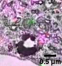
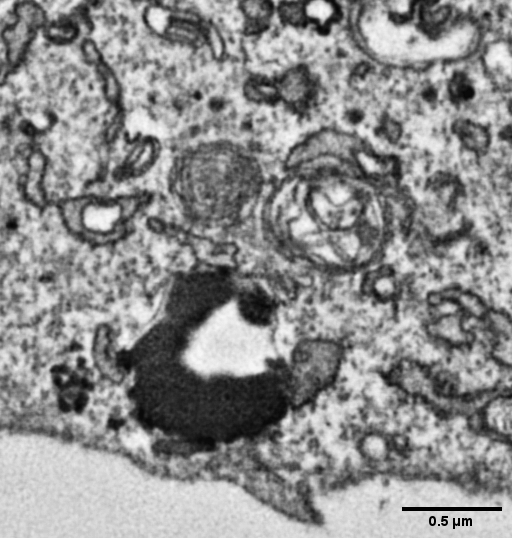
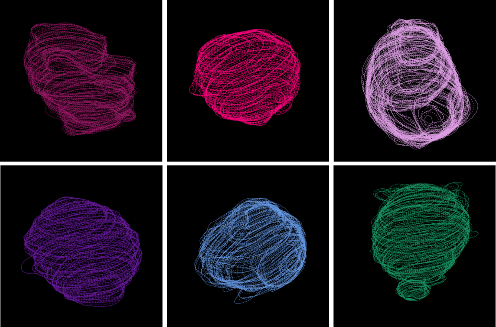

# 2. Generating ground-truth segmentations in IMOD

## 2.1 Why manual segmentation is required

The deep-learning model requires pre-labelled examples of autophagosomes.

Ground-truth annotations were generated by manually identifying autophagosomes in correlative light and
electron microscopy (CLEM) datasets and tracing their boundaries through the FIB-SEM stack.

Autophagosomes were identified based on their corresponding fluorescence signal. In the original dataset,
**GFP-LC3-positive** and **LysoTracker-negative** structures were used to identify autophagosomes.

{ width="300" }

{ width="300" }

*Correlating the fluorescence signal (left) with the FIB-SEM ultrastructure (right) identifies which
structures are autophagosomes. Scale bar: 0.5 µm.*

## 2.2 Open the FIB-SEM dataset in 3dmod

Open the image stack in 3dmod.

The FIB-SEM stack should contain sequential electron microscopy images representing consecutive sections
through the sample.

## 2.3 Create a contour for each autophagosome

For each identified autophagosome:

1. Navigate to the first slice containing the structure.
2. Create a new contour/object.
3. Trace the outer boundary of the autophagosome.
4. Move through the stack and continue tracing the same object.
5. Continue until the entire structure has been captured.

{ width="560" }

*A single autophagosome consists of a series of contours through the image stack.*

In the original dataset, approximately **32 autophagosomes per cell** were manually segmented.

## 2.4 Interpolate missing contours

Because contours were drawn on every second slice, intermediate contours can be generated using IMOD's
interpolation functionality. This provides a continuous 3D representation of the segmented autophagosome.

After interpolation:

- [ ] Inspect the interpolated contours.
- [ ] Correct any contours that do not accurately follow the membrane.
- [ ] Cap the model where appropriate.
- [ ] Generate a mesh if a 3D representation is required.

## 2.5 Export the annotations

The completed annotations are exported from IMOD as polygon/contour information. These annotations form
the ground truth for training AutoPhinder.

Continue with [Masks & dataset curation](dataset.md) to turn them into training data.
