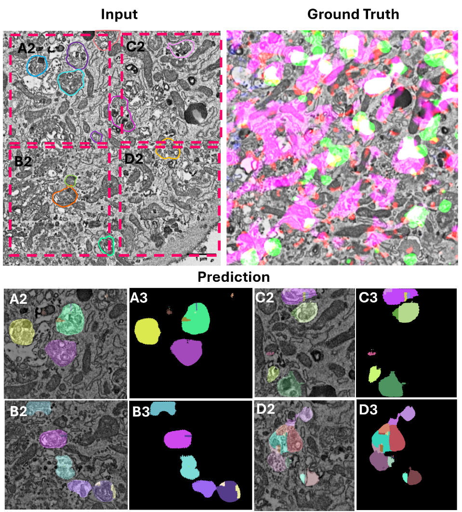
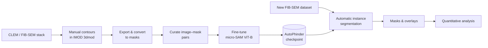

# AutoPhinder

**Automated segmentation of autophagosomes in FIB-SEM datasets using micro-SAM.**

AutoPhinder is a deep-learning-based workflow for the automated identification and segmentation of
autophagosomes in focused ion beam scanning electron microscopy (FIB-SEM) datasets.

The workflow combines manual ground-truth segmentation in [IMOD](https://bio3d.colorado.edu/imod/) with
[micro-SAM](https://github.com/computational-cell-analytics/micro-sam) to train an instance-segmentation
model capable of identifying autophagosomes in previously unseen FIB-SEM datasets.

{ width="560" }

## Workflow at a glance

The workflow consists of four main stages:

1. **Manual segmentation** of autophagosomes in IMOD
2. **Generation and curation** of training labels
3. **Fine-tuning** of a pre-trained micro-SAM model
4. **Automatic instance segmentation** of unseen FIB-SEM datasets

## Where to start

- **Just want to segment new data?**
  Install the environment, then go straight to [Inference on new data](inference.md). You do not need to
  retrain the model.

- **Training on your own annotations?**
  Follow the workflow in order: [Installation](installation.md) →
  [Ground truth in IMOD](ground-truth.md) → [Masks & dataset curation](dataset.md) → [Training](training.md).

- **Prefer a notebook?**
  The [Notebook walkthrough](notebooks/autophinder_walkthrough.ipynb) runs the whole workflow in Jupyter, from
  loading a FIB-SEM stack lazily to quantifying the segmented autophagosomes. Download it from that page.

- **Looking for a specific script?**
  See the [Script reference](scripts.md) for every utility in the repository and its options.

- **Applying AutoPhinder to a different sample type?**
  Read [Considerations](considerations.md) first.

