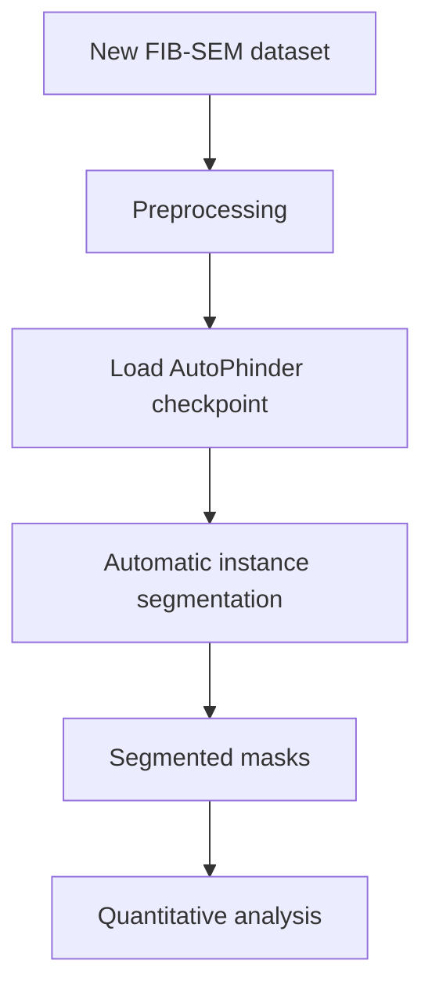

# 5. Using AutoPhinder on a new FIB-SEM dataset

Once the model has been trained, it can be applied to previously unseen FIB-SEM data.



## 5.1 Prepare the image stack

Place the new FIB-SEM images into an input directory:

```text
new_dataset/
├── image001.tif
├── image002.tif
├── image003.tif
└── ...
```

If your data is a single multi-page TIFF, split it into frames with `scripts/tiff_stack_converter.py`.

Ensure that:

- [ ] Images are readable by the selected image reader.
- [ ] The image dimensions are consistent.
- [ ] The images represent sequential sections through the FIB-SEM volume.
- [ ] Image intensity values are compatible with the preprocessing pipeline.

SAM expects 8-bit RGB input. `scripts/preprocess_for_sam.py` min–max normalises a microscopy image to 8-bit
and stacks it to three channels:

```python
from scripts.preprocess_for_sam import preprocess_for_sam

img8_rgb = preprocess_for_sam(raw_image)
```

## 5.2 Load the trained model

The trained checkpoint is loaded with micro-SAM:

```python
from micro_sam.automatic_segmentation import get_predictor_and_segmenter

predictor, segmenter = get_predictor_and_segmenter(
    model_type="vit_b",
    checkpoint="models/checkpoints/autophinder_model/best.pt",
    device="cuda",
)
```

!!! important "micro-SAM versions"
    micro-SAM's APIs change between releases. If the call above does not match your installed version, check
    the [micro-SAM documentation](https://computational-cell-analytics.github.io/micro-sam/). The
    `run_automatic_instance_segmentation()` wrapper in `fine_tune_vit_b.py` detects the installed signature
    (`image` / `input`, `image_paths` + `output_folder`, or `input_path` + `output_path`) and calls it
    correctly.

## 5.3 Automatic instance segmentation

AutoPhinder then performs **Automatic Instance Segmentation (AIS)** on the new dataset. The inference
workflow identifies individual candidate objects and generates an instance mask for each object.

```python
import imageio.v3 as imageio
from fine_tune_vit_b import run_automatic_instance_segmentation

image = imageio.imread("new_dataset/image001.tif")
prediction = run_automatic_instance_segmentation(
    image=image,
    checkpoint_path="models/checkpoints/autophinder_model/best.pt",
    model_type="vit_b",
    device="cuda",
    tile_shape=None,   # e.g. (384, 384) to tile large images
    halo=None,         # e.g. (64, 64) for seamless stitching between tiles
)
imageio.imwrite("results/masks/image001.tif", prediction)
```

A runnable version is in `examples/infer_image.py`; the [walkthrough notebook](notebooks/autophinder_walkthrough.ipynb) (section 6) segments a whole stack slice by slice and compares the result with the un-tuned micro-SAM model.

!!! note
    `examples/infer_image.py` currently imports from `sam_finetuning_clean`, an earlier name for the
    training script. Change the import to `from fine_tune_vit_b import run_automatic_instance_segmentation`
    when running it from the repository root.

The output can be organised as:

```text
results/
├── masks/
│   ├── image001.tif
│   ├── image002.tif
│   └── ...
└── visualisations/
    ├── image001_overlay.png
    ├── image002_overlay.png
    └── ...
```

The masks can subsequently be used for quantitative analysis of autophagosome:

- number
- area, diameter and volume
- shape
- spatial distribution
- relationship to other organelles
- ultrastructural characteristics

## 5.4 Visualising the segmentation

Automated predictions should be visually inspected before quantitative analysis. A simple overlay of the
original FIB-SEM image and the predicted segmentation mask is enough:

{ width="560" }

*Top: the full field with regions A–D marked. Bottom: for each region, predicted instances overlaid on the
FIB-SEM image (2) and the corresponding instance masks (3).*

This lets you determine whether the model is correctly identifying autophagosomes and whether false-positive
objects are present. Passing `--inference_image` to `fine_tune_vit_b.py` saves a side-by-side
input/prediction figure automatically.

!!! tip "Troubleshooting empty predictions"
    - Relax AIS filtering such as `pred_iou_thresh` and `min_mask_region_area`.
    - Double-check image preprocessing (8-bit, 3-channel, sensible contrast).
    - Verify the checkpoint path and that `model_type` matches the model the checkpoint was trained from.
